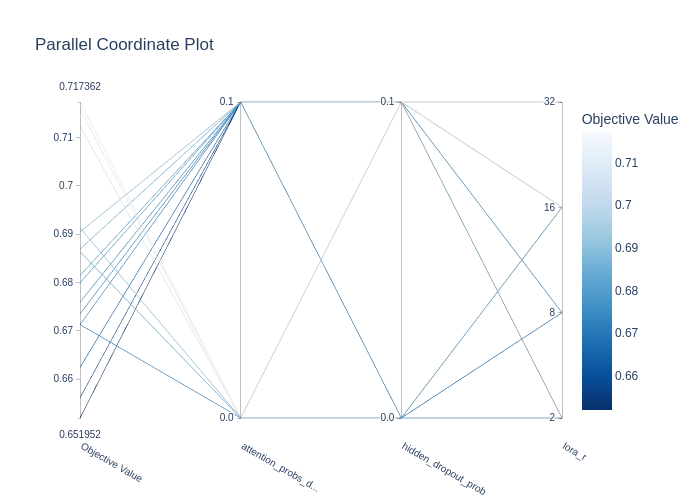
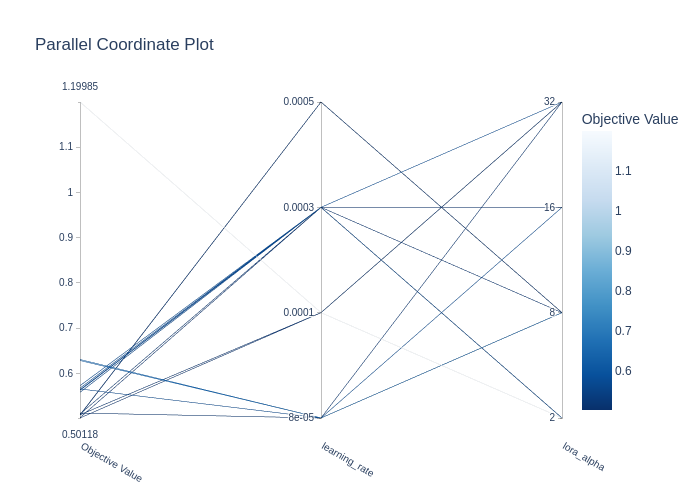
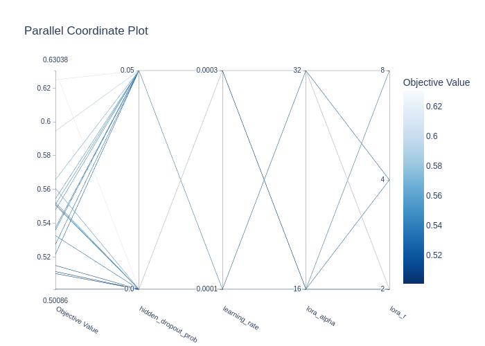

# HuggingFace's Transformers implementation for the Top 3 solution in Kaggle's [Feedback Prize - English Language Learning](https://www.kaggle.com/competitions/feedback-prize-english-language-learning) competition

## Introduction

abc

## Model, Training, and Inference

The training and inference notebooks can be found [here](https://www.kaggle.com/code/nguynthhi/notebooke778fa6ca8/notebook?scriptVersionId=156277114) and [here](https://www.kaggle.com/code/nguynthhi/notebooke778fa6ca8?scriptVersionId=156328021).

The model is based an extension of the pre-trained language model with the pooling mechanism and a fully-connected layer on top to predict the six analytic measures. The pre-trained language part was trained with [LoRA](https://arxiv.org/abs/2106.09685) applied on its attention layers while the pooling and fully-connected layers were trained from scratch. 

For the backbone, I used the [DeBERTa V3 Large](https://huggingface.co/microsoft/deberta-v3-large) model. For the pooling mechanism, I used the two-stage pooling. The first stage is to collapse the embeddings of the tokens in the same sentence, and the later is to apply mean pooling on these collapsed embeddings from all the sentences.

During the training time, the context length was 2048, while it was 640 during the inference time. This idea is also motivated from the 3rd solution as it highly impacted the final performance.

## Appendix

### Hyperparameters Tuning

The hyperparameters were tuned using [Optuna](https://optuna.org/). The code for the tuning can be found in the [hyperparam_tuning.py](./hyperparam_tuning.py) script.

I mainly focused on **tuning these five hyperparameters**: 

* `hidden_dropout_prob`, 
* `attention_probs_dropout_prob`, 
* `lora_r`, 
* `lora_alpha`, 
* and `learning_rate`. 

I split this tuning process into two main steps with one additional step. In the final step, to find the best combinations of the five hyperparameters. Finally, I re-tuned all of the five hyperparameters together based on the narrower param'set that I found in the first two steps:

* *First step*, I tuned the first three hyperparameters, the notebook can be found [here](https://www.kaggle.com/code/nguynthhi/notebooke778fa6ca8?scriptVersionId=156204675). During this step, I fixed the `lora_alpha` and `learning_rate` to 16 and 5.0e-5 respectively. 
  * The search space for the first three hyperparameters were:
    *  `hidden_dropout_prob` and `attention_probs_dropout_prob` in [0.0, 0.1],
    * and `lora_r` in [2, 8, 16, 32].
  * Based on the Fig. 1, the suitable values for the first three hyperparameters are: 
    * `hidden_dropout_prob` = [0.0, 0.05],
    * `attention_probs_dropout_prob` = 0.1,
    * and `lora_r` = [2, 4, 8].

    
    
<i>Figure 1</i>: Parallel Coordinate for tuning the first three hyperparameters in the first tuning step.

* *Second step*, I tuned the last two hyperparameters, the notebook can be found [here](https://www.kaggle.com/code/nguynthhi/notebooke778fa6ca8?scriptVersionId=156237286). During this step, `hidden_dropout_prob`, `attention_probs_dropout_prob`, and `lora_r` are fixed at 0.0, 0.1, and 2, respectively. 
  * The search space for the last two hyperparameters were:
    * `lora_alpha` in [2, 8, 16, 32],
    * and `learning_rate` in [8.0e-5, 1.0e-4, 3.0e-4, 5.0e-4].
  * Based on the Fig. 2, the suitable values for the last two hyperparameters are: 
    * `lora_alpha` = [16, 32],
    * and `learning_rate` = [1.0e-4, 3.0e-4].

    
    
<i>Figure 2</i>: Parallel Coordinate for tuning the last two hyperparameters in the second tuning step.

* *Additional step*, I re-tuned all of the five hyperparameters together based on the narrower param'set, the notebook can be found [here](https://www.kaggle.com/code/nguynthhi/notebooke778fa6ca8?scriptVersionId=156252738). During this step, the `attention_probs_dropout_prob` is fixed at 0.1 and the other four are based on the narrower sets that I found in the previous two steps.
  * Based on the Fig. 3, the ultimately suitable values for the five hyperparameters are: 
    * `hidden_dropout_prob` = 0.0,
    * `attention_probs_dropout_prob` = 0.1,
    * `lora_r` = 2,
    * `lora_alpha` = 16,
    * and `learning_rate` = 3.0e-4 (although the best value for this one is 3.0e-4, I slightly decreased it to **1.0e-4 during training** for more stability since the training steps are larger than during the tuning process).

    
    
<i>Figure 3</i>: Parallel Coordinate for final tuning all the five hyperparameters based on the narrower param sets.

